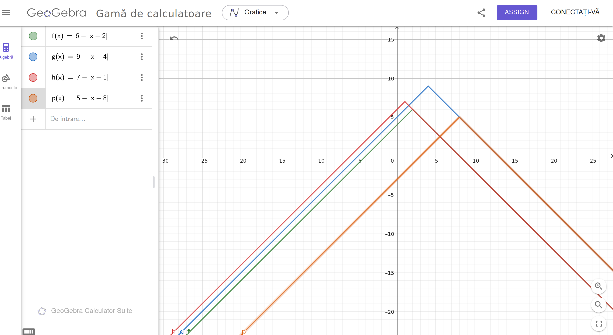

Drinciu Cristina 324CA

## Problema 1 -  Servere

For solving this problem I approached an easier way, using math and the graphs.
Basically, we need the find the power that we should apply to the servers in order to find the power of the system, which would be the minimum of them all.
We need to find the point A(x, y), where x is the current, and the y is the power generated.

We have the equation:
* P(i) - |C(i) - x| = 0.
* We end up with the solution x = C(i) +/- P(i).
* 

So for that I used the sum and the diff of the two vectors, C and P to calculate the possible values of the x (the needed power).

But we get a range of values quite large, we need to reduce it as much as possible, so that all the values for the graphs for the power are greater than 0 (are positive).

For that I calculated the maximum of the diff and the minimum of the sum (the minimum of the right parts of the graphs \ and the maximum of the left parts of the graphs / ).

The current needed to supply the system is the avverage one of the reduced range of values : min + max / 2.

Now that we know the current, we need the values of the powers, the needed aswer being the minimum of these values.

### Time complexity: O(n)
### Space complexity: O(n)

*** 

## Problem2 - "Colorare"
For implementing the solution I used dynamic programming.
I used a structure for reading the input: "struct region", that has a field for number of squares and a type (H or V).

Reading the input meant builiding a vector of region structures.
After reading I parsed the vector, bulding the dp(dynamic programming) vector, that uses the precedent state for countnig the ways of possible colouring.

The base case is represented by the number of ways that the first square can be coloured:
* H - 6 ways
* V - 3 ways

Let's presume that the precedent region is type A and then the current region is type B.
There are 4 possible cases:Complexitate spatiala:

* H H - 3 ways of colouring the next square
* H V - 1 way
* V H - 2 ways
* V V - 2 ways

The dp vector stores the number of possible ways of colouring at step index for dp[index].
First is coloured the first square of the region, after that the rest of nr_squares - 1.

Because the cases are divided like in a "tree" manner, it means multyplying each step the dp[i] with the specific number of colouring possibilities. For big numbers, it would be really innefficient.
Solution: instead of x^y normally using for, I used x^y the logarithmic was (guided by this code: https://www.geeksforgeeks.org/write-an-iterative-olog-y-function-for-powx-y/).

### Time complexity:  O(klog(m)), where k is the number of regions, and m is the average size of the regions in terms of squares.
### Space complexity: O(k)

***

## Problem3 - "Compresie"

For this problem, the first step is to check if the vectors can be compressed to the same length.

For that, I checked if the sums of the vectors are equal, because in worst case, the vectors can contain just one element, the sum.

If they can be conpressed to the same length, I started to parse the vectors using two indexes, one for each.
I also used two temporary sums for each that are initialized with the first element from each vector.

The logic: while I didn't reach the end of neither a vector, I check if tmp_sum_A == tmp_sum_B.
* true: increment both indexes to get the next element. The sums are now intialized with the new elements.
* false: check wich is lower. The vector that contains the element that is lower, will move forward to build its sum until is equal with the sumt of the other vector (will compress) and the numuver of compressions is increased for that vector.

In the end, after having the numbers of compressions for each vector, the maximum length of the compressed vectors is equal with  "length of a vector - nr_compressions for that vector".

### Time complexity:  O(m + n)
### Space complexity: O(m + n)

***

## Problem4 - "Criptat"

For solving this problem, I tried to generate more posible lengths of the password with different frequency of the dominand character.

For each word received from the input, I assigned a map <char, int>, so that it contains the frequency of each character for each word. Also, while building the maps, I also built a set that contains the unique characters that appear in the given words, to see wich characters we have to work with.

Using a map and a set for the charcaters is more efficient to make sure that we do not have to work with the whole alphabet.

The next step is to generate more possible combinations of concatenated words and to check the frequency of the dominant charcter.
For that I used a matrix: 
* each line is for each unique character existent in the words
* each line has MAX_LONG_LEN (a maximum length of 1000/10^4).
* The index of the columns represent the possible length of the concatenation and the value represents the frequency of the dominant charcter.

The logic: (got a little bit of help from Chat GBT to put everything in place)
* I tried to build words with as long as I could, with a frequency of the dominant character as high as a could.
* Parse the list of the given words
* If the value of the chars_combinations[i][k] is 0, it means a password with the length k can't be reached so it is skipped
* If the value of chars_combinations[i][k + curr_word_len] is less than the chars_combinations[i][k] + curr_freq, whre curr_freq is the frequency of the dominant char we are treating in the current word, it is updates so that it can be reached the maximum possible. Bassicaly I check if it is worth concatenatig the current word based on the frequency.
* The problem is quit similar with the KnapSack problem, where the weight is the length of the word and the price is the frequency of the dominant character we are treating.
* Note: the line in the matrix of the current dominant character is parsed backwars to avoid reusing the already updated possible lengths, which means also to avoid using the same words multiple times (if the problem required using the same words multiple times, it wouldn't be a problem).
* At the end I search in the matrix wich is the maximum length that validates the condition "length < frequency * 2".

### Time complexity: O(d * n * MAX_LONG_LEN), d = number of distinct characters
### Space complexity: O(d * MAX_LONG_LEN)

***

## Problem5 - "Oferta"

For this problem I implemented just the feature for the minimum price (k = 1).

I used the dynamic programming approach. I used a vector dp that for each step its value for dp[i] is the best price for i products.
The base case is 0 (price 0 for 0 products). 
For the current product i, dp[i] initialy is dp[i-1] + price[i]. After this I check if it is worh applying an offer, taking the minum price out of the 3 posibillities.
At the end, the final price is the value of dp[number_of_products].

### Time complexity: O(n)
### Space complexity: O(n)

***
